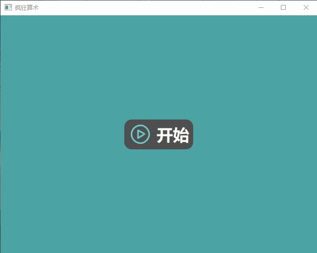
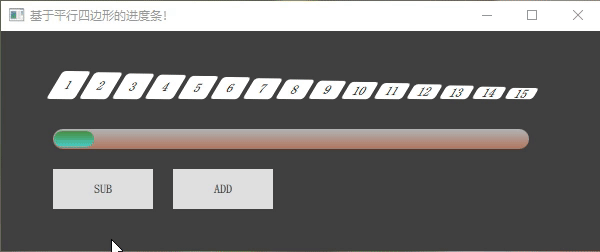
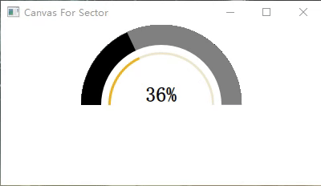
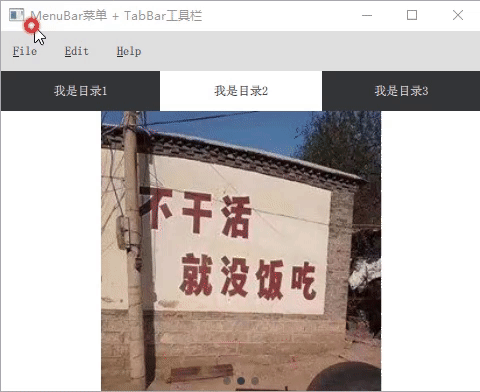
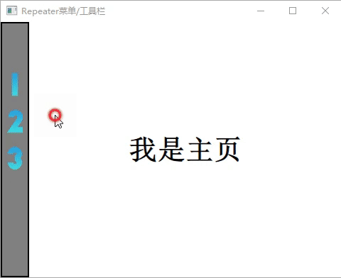
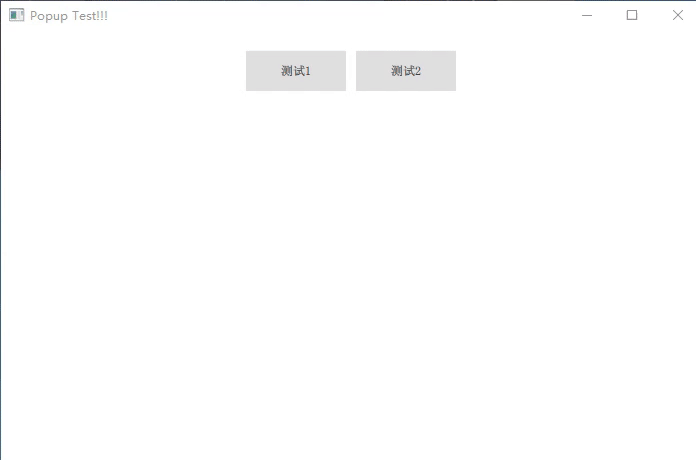
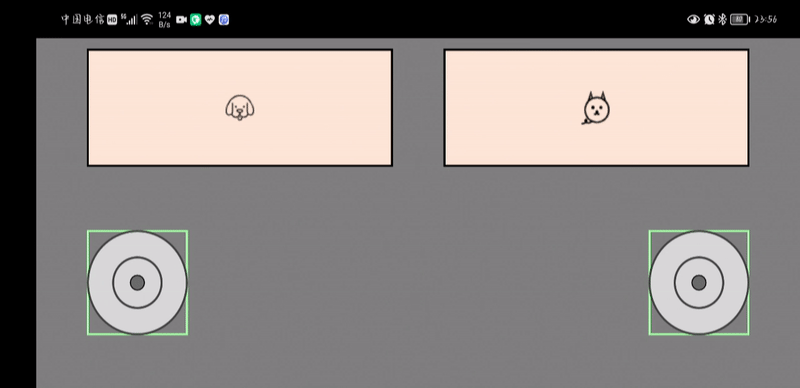

# QmlLearningPro
Qml 学习代码

# 项目列表

## 1、综合相关

### 1.CrazyMath.pro [Android] [Windows]

**创建日期**：2021.10.03 ； **20240821测试**：  正常 
 
概要： 算术小游戏，主要熟悉QML和C++的混合编程、和翻译等

关键控件/库： column、SpringAnimation、transitions、State、QSetting

博客地址：https://blog.csdn.net/qq_16504163/article/details/120459571

---

## 2、控件相关

### 1. ParaProgressBar.pro   [Android] [Windows]

**创建日期**： 2022/08/21； **20240821测试**：正常 

由15个平行四边形组成的进度条

博客地址：https://blog.csdn.net/qq_16504163/article/details/115030440

---

### 2. CanvasSector.pro [Android] [Windows]

**创建日期**：20210518； **20240821测试**：正常 

CanvasSector 基于Canvas的扇形进度条

博客地址：https://blog.csdn.net/qq_16504163/article/details/116952399

---

### 3.MenuForButton.pro [Android] [Windows]

**创建日期**：20210518； **20240821测试**：正常 

MenuForButton 基于Button的目录

MenuForListview 基于Listview目录

MenuForRepeater 基于Repeater目录

MenuForTabBar 基于TabBar的目录

博客地址： https://blog.csdn.net/qq_16504163/article/details/109555984

---

### 4. Popup.pro [Android] [Windows]

**创建日期**：2022.03.12 **20240821测试**：正常

概要： 在 QML 文件中，不论子文件有多少层，只需在根节点文件中添加 Popup 组件，都可以在界面中弹出置顶

关键控件： popup、Component、mapFromItem

博客地址：https://chuhan.blog.csdn.net/article/details/123439512

---

### 5.VirtualJoystick  [Android] [Windows]

**创建日期**：2021.08.02 ； **20240821测试**：正常
 
概要： VirtualJoystick  增加虚拟操作杆，捕获触点，在控制物体移动。

关键控件： MultiPointTouchArea、TouchPoint、Timer

博客地址：https://blog.csdn.net/qq_16504163/article/details/119318325

---

## 3、工具相关

### 1. TranslationsDemo.pro [Android] [Windows]

**创建日期**：2022.07.09 ； **20240821测试**：正常
 
概要： 介绍了 Qt 翻译流程，可利用 QT_TRANSLATE_NOOP 翻译 Map和函数外部的字符串

关键词：QT_TRANSLATE_NOOP、QMap<uint32_t, QString>、QSringList

关键控件： Label、Repeater

博客地址：https://chuhan.blog.csdn.net/article/details/125686784

---

## 4、UI相关

## 5、地图类

### 1. MapFermatSpiral.pro  [Android] [Windows]

**创建日期**：20211129；  **20240821测试**： 正常
 
概要： 在地图中画螺旋曲线

关键词：SpiralCurve、螺旋曲线、费马曲线

关键控件： Map、MapPolyline、TextField

博客地址：https://chuhan.blog.csdn.net/article/details/121621392

---

### 2. MapGetdistance [Android] [Windows]

**创建日期**: 2021.11.29； **20240821测试**：正常

概要：在地图中测距

关键控件： Map

博客地址：https://blog.csdn.net/qq_16504163/article/details/109379164

---

## 六、视频类
